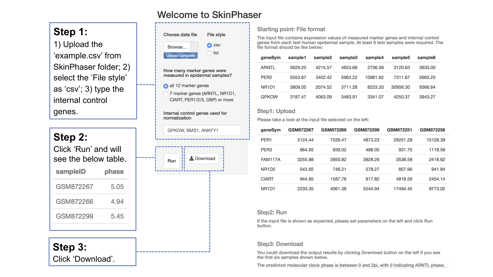

## Introduction

SkinPhaser is a Shiny app of predicing the circadian phase using expression values of 12 biomarker genes from human epidermis samples. These biomarker genes include: ARNTL, NR1D1, NR1D2, PER1, PER2, PER3, CIART, DBP, TEF, NAMPT, PAQR3, FAM117A. For overcoming the expression bias across tested samples, expression values of three non-circadian genes in skin (GPKOW, BMS1 and ANKFY1) are also suggested to measure for each epidermis sample. SkinPhaser can predict the circadian phase using one epidermis sample for each tested subject. The minimal number of input samples is 6. For improving the prediction accuracy, the users could incluce 1) more subjects, 2) subjects with different chronotypes, 3) longer time window (e.g. 12 h window from 7am to 7pm) for sample collection, 4) multiple samples collected from each subject, 5) any other strategy that avoid testing majority samples with similar circadian phases (e.g. all epidermis samples collected at the same wall time from subjects with the same chronotype). 
 
## Usage
```r
# install 'shiny' package (if 'shiny' is not installed yet)
install.packages("shiny")
# load 'shiny' package
library(shiny)

# the easy way to run this web application 
runGitHub("SkinPhaser", "gangwug")

# Or you can download all files from this page, and place these files into an directory named 'SkinPhaser'. 
# Then set 'SkinPhaser' as your working directory (see more introduction about working directory-http://shiny.rstudio.com/tutorial/quiz/). 
# Now you can launch this app in R with the below commands.
runApp("SkinPhaser")

```
There is an input example file ('example.csv') in this folder. For testing this example file, please follow the steps shown in the below picture. 




## For more information
